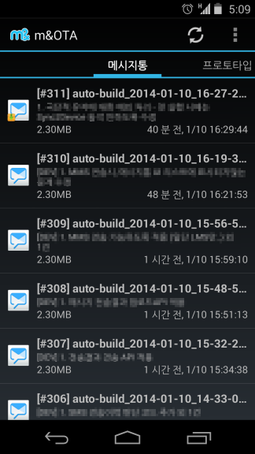
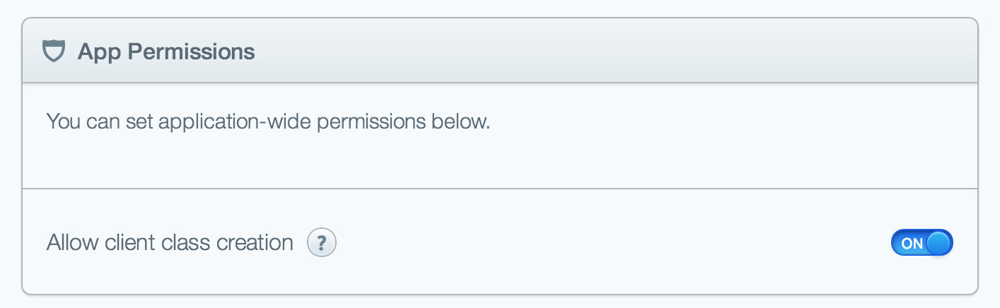

OTA application for Android using parse.com
===========================================

인포뱅크 내부에서 사용 중인 Continous Integration Android Client 소스 및 Jenkins 관련 파일입니다.

[Continuous Integration](http://http://pragmaticstory.com/224)을 도입하면, 직접 경험해보지 않은 조직에서는 상상도 할 수 없는 긍정적인 변화가 아주 조금씩 일어나는데요, kth에서도 그랬고 현재 근무하는 인포뱅크에서도 아주 작은 변화를 일으키고 있습니다.

kth에서야 빵빵한 서버 개발자의 지원하에 CI 시스템을 별 어려움 없이 구축했는데, 인포뱅크의 주력사업이 B2C가 아니다보니 구축에 어려움이 있어서 이런 저런 방법으로 시도하다가 최종적으로 Jenkins와 [Parse.com](http://parse.com)을 이용한 OTA 앱을 개발해서 사용 중입니다.

OTA(Over The Air)를 간단하게 구축하고 싶으시다면 저희 사례를 참고하시면 좋을 듯 해서 소스를 공개합니다.

**동작은 다음과 같습니다.**

1. 최초 실행 시 전화번호 기반 로그인을 시도합니다. (전화번호가 없으면 IMEI를 사용합니다.)
2. 등록된 전화번호가 아니면 권한 요청만 하고 App은 종료됩니다.
3. 전화번호 등록을 위해서는 Parse.com에서 AccessRequest class를 확인해서 User에 수동으로 추가하셔야 합니다.
4. OTA application의 self update는 OtaClient class를 수동으로 추가하셔야 하며, APK도 수동으로 등록해주셔야 합니다.
   * OtaClient Class 추가 field 구성
  
>      bytes - Number type
>      description - String type
>      file - File type
>      mandatory - Boolean type
>      versionCode - Number type
>      versionName - String type

**주의**
1. AccessRequest class가 생성이 안 될 경우 General Settings에서 App permissiondl "ON" 인지 확인하십시오.

**문의**

ohjongin@gmail.com
